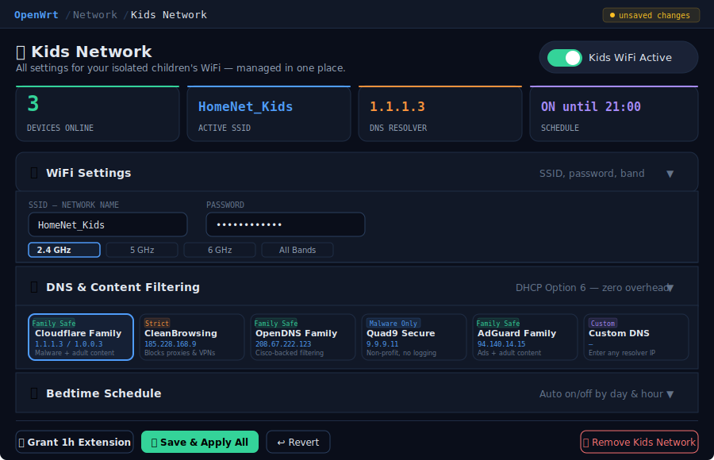
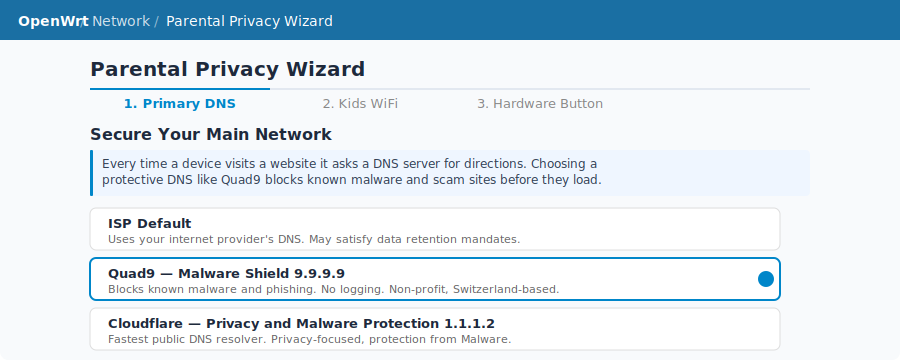

# luci-app-parental-privacy-vlan

 LuCI wizard and dashboard for a fully isolated Kids Network using a
  dedicated VLAN on the main br-lan bridge (DSA/OpenWrt 22.03+ required).
  mac80211 WiFi driver required (ath9k/ath10k/ath11k/mt76).
  Broadcom brcmfmac is NOT supported — use the bridge edition instead.



---

## Features

- **NETWORK ISOLATION (VLAN)**
  - The Kids Network defaults to VLAN ID 28, which was chosen deliberately to align with the private subnet range 172.28.x.x — resulting in a router IP of 172.28.28.1 and client addresses in the 172.28.28.0/24 block. This makes the relationship between the VLAN ID and the subnet immediately obvious to anyone reading the router config. The VLAN ID 28 is also essentially unused in consumer networking, where common VLANs for guest networks, IPTV, VoIP, and CCTV typically occupy the lower range (VLAN 10–30). If VLAN 28 is already taken, the installer works down from the high end (80, 90, 100) before moving into the mid-range (40–70), deliberately staying away from the low block where those common services live and leaving those IDs free for their intended use. Only if all preferred candidates are exhausted does the installer try 15 and 25 — non-round numbers unlikely to be in use on any network. If none of the 11 candidates are available, the install aborts with a clear error rather than silently claiming a VLAN that may already be in use, protecting the integrity of your existing network configuration.
  - Detects all physical DSA LAN ports dynamically and tags them — no
    hardcoded port names.
  - Creates a br-lan.<vlan> subinterface with a dedicated subnet in the
    172.28.<vlan>.0/24 range (e.g. VLAN 10 → 172.28.10.0/24).
  - Aborts cleanly with a log message if DSA is absent or swconfig is
    detected, allowing the bridge edition to be used instead.
  - Single-NAT: the WAN zone handles masquerade for all traffic; the kids
    zone never double-NATs, giving consoles NAT Type 2 (Moderate) or better.

- **WIRELESS**
  - Creates VAPs on all detected bands: 2.4 GHz (WPA2), 5 GHz (WPA2), and
    6 GHz (WPA3/SAE) — all sharing the same SSID and key.
  - SSID defaults to <PrimarySSID>_Kids and is fully customisable.
  - A strong random password is generated at install time via openssl or
    /dev/urandom and stored in UCI for the dashboard to display.
  - WiFi is intentionally left broadcasting at all times; internet access
    is controlled by a firewall rule so devices stay associated and keep
    their IPs even when the schedule blocks them.

- **FIREWALL**
  - Dedicated 'kids' zone with REJECT default for input and forward.
  - Specific ACCEPT rules for DHCP (UDP 67), DNS (TCP/UDP 53), ICMP, and
    UPnP (UDP 1900) so miniupnpd can serve consoles.
  - DNS interception: all DNS queries (TCP/UDP port 53) are redirected back
    to the router via DNAT for both IPv4 and IPv6, preventing bypass.
  - Internet schedule block: installs a kids→wan REJECT rule at cron time
    rather than toggling radios — no disruptive wifi restart, wired VLAN
    devices blocked identically to wireless ones.

- **DNS FILTERING**
  - DHCP Option 6 pushes a family-safe DNS (default: Cloudflare 1.1.1.3 /
    1.0.0.3 for Families) to every kids device.
  - Configurable from the wizard; choices include Cloudflare Families,
    CleanBrowsing Family, and OpenDNS FamilyShield.
  - Primary LAN DNS is also configurable (Quad9, Cloudflare, AdGuard, ISP).

- **SAFESEARCH ENFORCEMENT**
  - Forces SafeSearch on Google (all regional domains), Bing, YouTube
    (Restricted Mode), and DuckDuckGo via dnsmasq CNAME records.
  - Works at DNS level — no DPI, no SSL inspection, no accounts needed.

- **DNS-OVER-HTTPS (DoH) BLOCKING**
  - Prevents browsers from silently bypassing the DNS filter using
    encrypted DNS (DoH) on port 443.
  - Blocks known DoH provider IPs (Cloudflare, Google, Quad9, AdGuard,
    OpenDNS, CleanBrowsing) for both TCP and UDP (HTTP/3).
  - Uses nftables sets on OpenWrt 22.03+ with an iptables fallback for
    older kernels. IPv4 and IPv6 providers are both covered.

- **TIME SCHEDULING**
  - Per-day schedules with up to 4 allowed internet-access windows per day.
  - Default schedule: Mon–Thu and Sun 06:00–20:00, Fri–Sat 06:00–21:00.
  - Cron entries are written in UTC with automatic local→UTC conversion,
    including half-hour timezone offset handling (+05:30, +05:45, etc.).
  - 1-hour extend: a one-shot cron entry restores access immediately and
    re-blocks exactly 60 minutes later, then self-removes from crontab.

- **HARDWARE BUTTON**
  - Assigns a physical router button (WPS, Reset, or custom GPIO pin) as
    an instant kids WiFi / internet toggle via an OpenWrt hotplug script.
  - No reboot required; takes effect on the next button press.

- **CROSS-VLAN BROADCAST RELAY**
  - Uses udp-broadcast-relay-redux and umdns so kids-VLAN devices can
    discover and use services on the main LAN and vice versa.
  - Narrow per-service firewall rules preserve the REJECT default posture.
  - Services relayed (both directions unless noted):
      mDNS / Bonjour   (UDP 5353 multicast) — AirPrint, AirPlay,
                        Chromecast, Avahi, HomeKit, Apple TV
      SSDP / UPnP      (UDP 1900 multicast) — DLNA, Chromecast, smart TVs
      WSD              (UDP 3702 multicast) — Windows printer/scanner
                        discovery (Web Services for Devices)
      NetBIOS-NS       (UDP 137 broadcast)  — Windows LAN name resolution
      IPP + RAW print  (TCP 631 / 9100)     — kids → LAN printer direct
      Steam            (UDP/TCP 27036)      — Local Game Transfers and
                        Remote Play Together
      Minecraft Bedrock (UDP 19132 / TCP 19133) — console, mobile, and
                        Windows 10 edition LAN world discovery
      Minecraft Java    (UDP 4445 / TCP 25565) — Java Edition LAN world
                        discovery and direct connect

- **SETUP WIZARD**
  - Three-step guided wizard: primary LAN DNS, kids WiFi + DNS, hardware
    button. All applied sequentially via rpcd without a page reload.

- **DASHBOARD**
  - Single-page view showing: live device list (from DHCP leases), current
    internet status, SSID/password, schedule, SafeSearch, DoH, and relay
    toggles. Extend and Remove buttons included.

---

## Screenshots

### Dashboard


The main dashboard shows live device count, active SSID, current DNS resolver, and next schedule event — plus collapsible panels for every setting.

### Bedtime Schedule


Click or drag cells on the weekly grid to define allowed hours. Quick presets include School Days, Strict, and Weekends Only. Changes are written directly to `/etc/crontabs/root`.

### Setup Wizard



The three-step wizard walks through primary DNS selection, Kids WiFi credentials, and optional hardware button assignment. Existing config is never overwritten.

---

## Requirements

| Dependency | Purpose |
|---|---|
| `luci-base` | LuCI framework |
| `nftables` | DoH blocking firewall rules (falls back to iptables) |
| `udp-broadcast-relay-redux` | Relays UDP broadcast and multicast packets (mDNS, SSDP, Steam, Minecraft, WSD, NetBIOS) between the kids VLAN and the main LAN |
| `umdns` | OpenWrt mDNS daemon; extended to serve both interfaces so AirPrint, AirPlay, and HomeKit resolve correctly across the VLAN boundary |

OpenWrt 22.03 or later recommended. Works on 21.02 with iptables fallback.

---

## Installation

### From the packages feed (once merged)

```sh
opkg update
opkg install luci-app-parental-privacy-vlan
```

### Manual install (ipk)

Download the latest release `.ipk` from the [Releases](https://github.com/eddwatts/luci-app-parental-privacy-vlan/releases) page, copy it to your router, and run:

```sh
opkg install luci-app-parental-privacy-vlan_1.0.0_all.ipk
```

### Build from source

Clone this repo into your OpenWrt buildroot packages feed:

```sh
cd /path/to/openwrt
git clone https://github.com/eddwatts/luci-app-parental-privacy-vlan.git package/luci-app-parental-privacy-vlan
make menuconfig   # select LuCI > Applications > luci-app-parental-privacy-vlan
make package/luci-app-parental-privacy-vlan/compile
```

---

## What gets installed

| File | Destination |
|---|---|
| `parental_privacy.lua` | `/usr/lib/lua/luci/controller/` |
| `kids_network.htm` | `/usr/lib/lua/luci/view/parental_privacy/` |
| `wizard.htm` | `/usr/lib/lua/luci/view/parental_privacy/` |
| `luci-app-parental-privacy-vlan.json` | `/usr/share/rpcd/acl.d/` |
| `block-doh.sh` | `/usr/share/parental-privacy/` |
| `99-parental-privacy` | `/etc/uci-defaults/` (runs once on first boot) |
| `30-kids-wifi` | `/etc/hotplug.d/button/` |

The `99-parental-privacy` uci-defaults script runs once at first boot to create the `kids` network interface, DHCP pool, firewall zone, DNS redirect rule, and wireless interfaces for all detected bands. It does not overwrite any existing configuration.

---

## First-time setup

After installing, navigate to **Network → Kids Network → Setup Wizard** in the LuCI web interface. The wizard covers:

1. **Primary DNS** — optionally upgrade your main network to a protective resolver
2. **Kids WiFi** — set SSID, password, DNS, and which band(s) to use
3. **Hardware button** — optionally assign a physical button to toggle the network

The dashboard is then available at **Network → Kids Network**.

---

## Hardware button

The hotplug script at `/etc/hotplug.d/button/30-kids-wifi` handles:

- **GL.iNet slider** (`BTN_0`) — each position maps to on/off
- **WPS button** — single press toggles the network
- **All bands in sync** — toggles `kids_wifi`, `kids_wifi_5g`, and `kids_wifi_6g` together

To find your router's button name, check the [OpenWrt Hardware Wiki](https://openwrt.org/toh/start) for your model, then set the GPIO pin in the dashboard under **Hardware Kill-Switch**.

---

## Network architecture

```
Internet
    │
  [WAN]
    │
 OpenWrt router
    ├── br-lan  (192.168.1.x)   ← your home devices
    └── br-kids (172.28.10.x)   ← isolated kids network
            │
        Firewall zone: kids
            ├── Input:   REJECT  (except DHCP, DNS, ICMP)
            ├── Forward: REJECT  → WAN only
            └── DNS intercepted: all port-53 traffic redirected to dnsmasq
```

Kids devices receive DNS via DHCP Option 6. A DNAT rule redirects any attempt to use a different DNS server back to the router. DoH blocking prevents browsers from encrypting around the filter entirely.

---

## License

GPL-2.0-or-later — see [LICENSE](LICENSE)

## Maintainer

Edward Watts
